#GNU Social clients

> fork of wiki.gnusocial.de/en:gnusocial:clients

## Smartphone

### Android

##### AndStatus
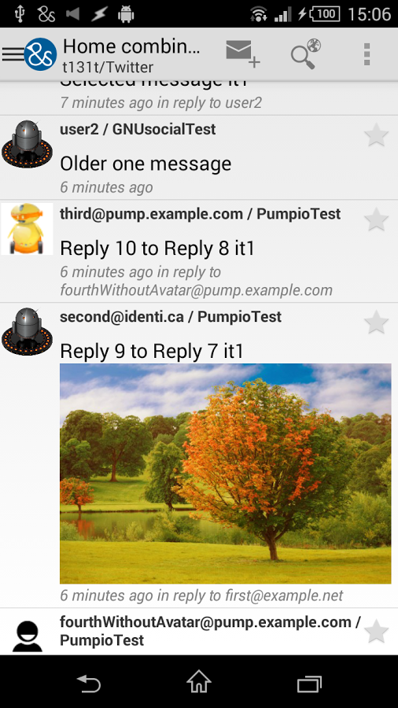
- Developer: [Yuri Volkov](https://loadaverage.org/yvolk)
- Open Source/FLOSS:  ✔
- Download: [F-Droid](https://f-droid.org/repository/browse/?fdid=org.andstatus.app) or [Google Play](https://play.google.com/store/apps/details?id=org.andstatus.app)

##### Twidere
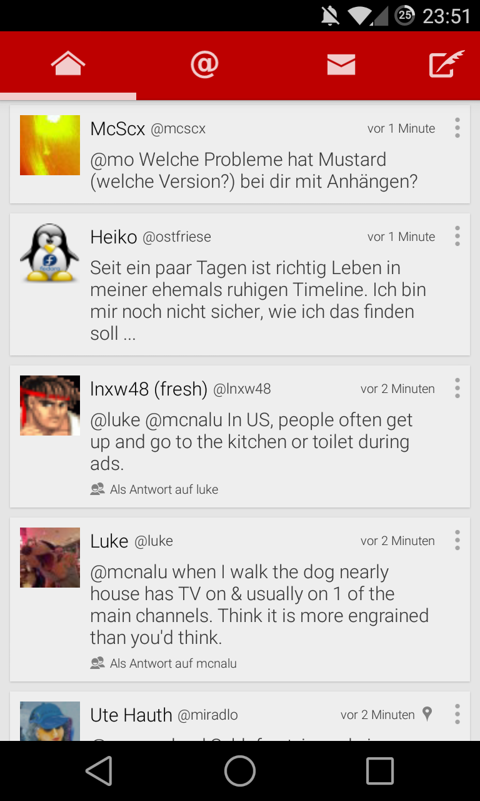
- Developer: [Mariotaku Lee](https://quitter.se/mariotaku)
- Open Source/FLOSS: ✔
- Download: [F-Droid](https://f-droid.org/repository/browse/?fdid=org.mariotaku.twidere) or [Google Play](https://play.google.com/store/apps/details?id=org.mariotaku.twidere)

##### Twittnuker
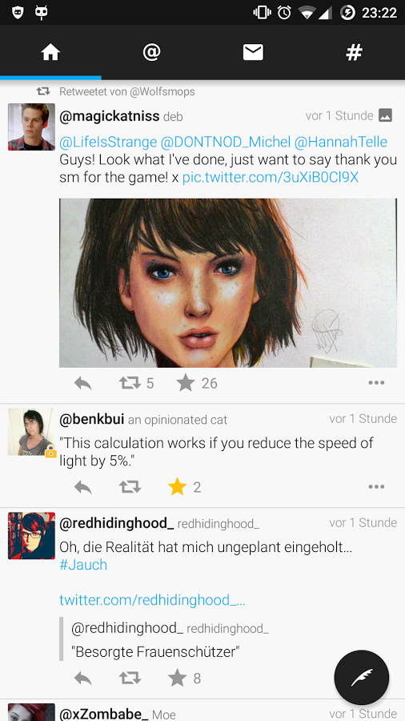
- Developer: [vanita5](https://github.com/vanita5)
- Open Source/FLOSS:  ✔
- Download: [Google Play](https://play.google.com/store/apps/details?id=de.vanita5.twittnuker)

##### Mustard
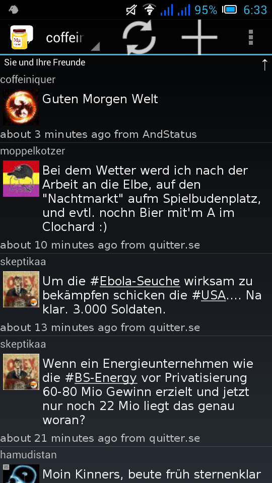
- Developer: not active
- Open Source/FLOSS:  ✔
- Download: [F-Droid](https://f-droid.org/repository/browse/?fdid=org.mustard.android) or [Google Play](https://play.google.com/store/apps/details?id=org.mustard.android)

##### MustardMOD
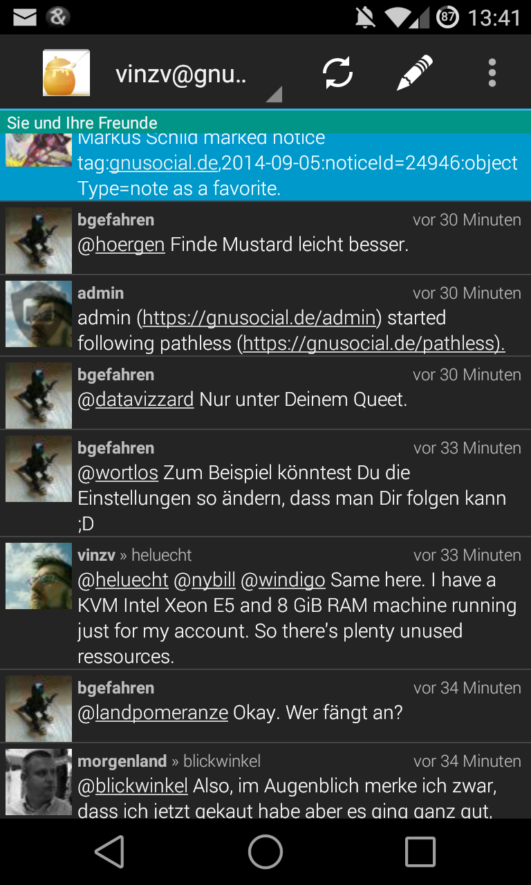
- Developer: is needed!
- Open Source/FLOSS:  ✔
- Download: [F-Droid](https://f-droid.org/repository/browse/?fdid=org.mumod.android) or [Google Play](https://play.google.com/store/apps/details?id=org.mumod.android)

### iOS

##### Shoyu
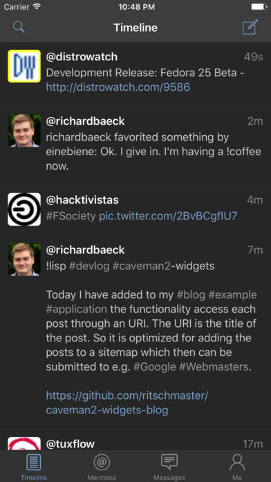
- Developer: Nonthawat Srichad
- Open Source/FLOSS: ✘
- Download: [iTunes](https://itunes.apple.com/app/shoyu-statusnet-gnusocial/id1059687793)

##### Mayo
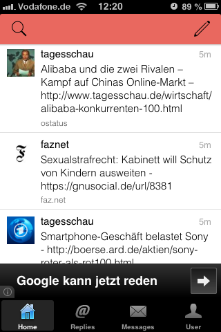
- Developer: ?
- Open Source/FLOSS:  ✘
- Download: [iTunes](https://itunes.apple.com/fr/app/mayo-for-status.net/id739122118)

##### Neustatus
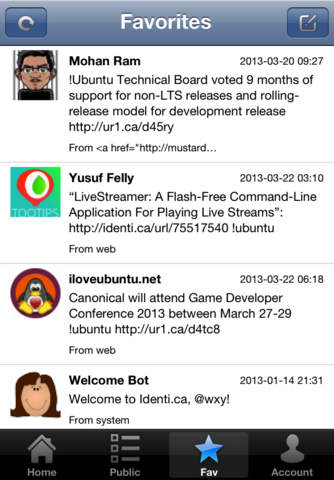
- Developer: ?
- Open Source/FLOSS:  ✘
- Download: [iTunes](https://itunes.apple.com/de/app/neustatus/id625987479)

## Desktop

### Linux

##### Heybuddy!
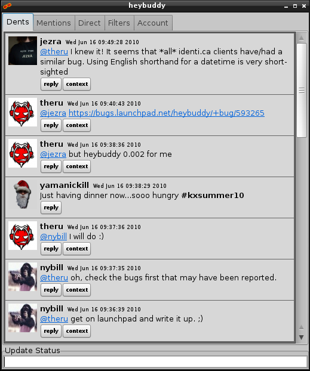
- Developer: [Jezra Lickter](http://status.jezra.net)
- Open Source/FLOSS:  ✔
- Download: [project page](http://www.jezra.net/projects/heybuddy)

##### Choqok!
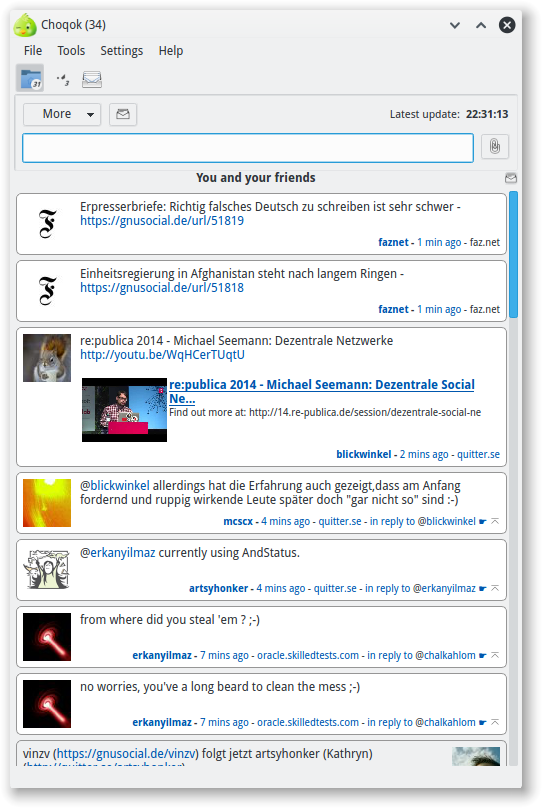
- Developer: [Mehrdad Momeny, Andrey Esin](http://choqok.gnufolks.org/about)
- Open Source/FLOSS:  ✔
- Download: [project page](http://choqok.gnufolks.org)

##### Yaics
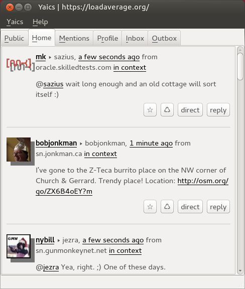
- Developer: [Stig Atle](https://quitter.no/stigatle)
- Open Source/FLOSS:  ✔
- Download: [project page](https://stigatle.no/yaics)

### Windows

##### Yaics

- Developer: [Stig Atle](https://quitter.no/stigatle)
- Open Source/FLOSS:  ✔
- Download: [project page](https://stigatle.no/yaics)
